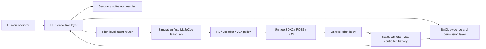

# Unitree Robotics Intake

## Purpose

This note captures the first HPP V5 intake of official Unitree Robotics assets from GitHub and Hugging Face.

The goal is not to vendor Unitree code into HPP V5 yet. The goal is to identify the clean integration path for future embodied HPP work while keeping real robot control gated behind simulation, safety, and explicit operator approval.

## Source Links

- Unitree Hugging Face collections: https://huggingface.co/unitreerobotics/collections
- Unitree GitHub organization: https://github.com/unitreerobotics
- `unitree_sdk2_python`: https://github.com/unitreerobotics/unitree_sdk2_python
- `unitree_sdk2`: https://github.com/unitreerobotics/unitree_sdk2
- `unitree_rl_gym`: https://github.com/unitreerobotics/unitree_rl_gym
- `unitree_rl_lab`: https://github.com/unitreerobotics/unitree_rl_lab
- `unitree_mujoco`: https://github.com/unitreerobotics/unitree_mujoco
- `unitree_sim_isaaclab`: https://github.com/unitreerobotics/unitree_sim_isaaclab
- `unitree_lerobot`: https://github.com/unitreerobotics/unitree_lerobot
- `unitree_ros2`: https://github.com/unitreerobotics/unitree_ros2

## High-Value Asset Classes

### 1. Body I/O And Robot Communication

Primary assets:

- `unitree_sdk2_python`
- `unitree_sdk2`
- `unitree_ros2`

Useful notes:

- `unitree_sdk2_python` provides a Python interface for `unitree_sdk2`.
- It uses CycloneDDS for communication.
- Examples include high-level status/control, low-level status/control, wireless controller state, front camera, obstacle avoidance, lights, and volume.
- Low-level motor control requires careful handling because it can conflict with built-in sport mode services.
- `unitree_ros2` exposes ROS2 communication and examples for sport mode state, low-level state, wireless controller state, sport mode control, and motor control.

HPP implication:

HPP should initially subscribe to state and publish no live motor commands. The first safe bridge is telemetry-only.

### 2. Simulation And Sim-to-Real

Primary assets:

- `unitree_mujoco`
- `unitree_rl_gym`
- `unitree_rl_lab`
- `unitree_sim_isaaclab`

Useful notes:

- `unitree_mujoco` is built around `unitree_sdk2` and MuJoCo and is explicitly designed for transition from simulation to physical development.
- `unitree_mujoco` includes C++ and Python simulator paths and robot description files.
- `unitree_rl_gym` supports Go2, H1, H1_2, and G1 with a workflow of `Train -> Play -> Sim2Sim -> Sim2Real`.
- `unitree_rl_lab` is built on IsaacLab and supports Go2, H1, and G1-29dof.
- `unitree_sim_isaaclab` uses the same DDS protocol as the real robot and supports data collection, playback, generation, and validation tasks.

HPP implication:

The first executable robotics target should be simulation-only:

1. read simulated DDS/ROS2 state,
2. classify HPP mode,
3. produce a high-level intent recommendation,
4. log evidence,
5. do not send live actuator commands.

### 3. Manipulation, Teleoperation, And Imitation Learning

Primary assets:

- `unitree_lerobot`
- Unitree Hugging Face datasets
- Unitree VLA/VLM models
- `xr_teleoperate`, `kinect_teleoperate`, and AVP-related teleoperation paths

Useful notes:

- Unitree Hugging Face includes collections for `UnifoLM-VLA-0`, `UnifoLM-WMA-0`, G1 Dex1/Dex3 datasets, G1 Brainco datasets, Z1 arm datasets, and whole-body teleoperation datasets.
- `unitree_lerobot` supports dataset conversion, LeRobot training validation, model deployment, real-world testing, and replay.
- `unitree_lerobot` references ACT, diffusion policy, Pi0, Pi05, and GR00T policy training paths.
- Real robot testing flags include policy path, dataset repo id, episodes, frequency, arm, end-effector, visualization, and `send_real_robot`.

HPP implication:

HPP should not start by training a robot policy. It should start by reading dataset schemas and simulation replay loops, then attach HPP state routing and evidence logging around them.

## HPP Robotics Architecture

## Integration Stages

### Stage 0: Read-Only Inventory

- Track official repos, docs, licenses, supported robots, examples, and deployment paths.
- No cloning large datasets or model weights unless required.
- No live robot network commands.

### Stage 1: Telemetry Schema

- Define a normalized HPP robot telemetry record:
  - timestamp
  - source
  - robot model
  - interface
  - mode
  - battery / power
  - IMU
  - joint state summary
  - controller state
  - safety flags
  - evidence hash placeholder

### Stage 2: Simulation Watcher

- Connect to simulated Unitree state only.
- Classify state as calm, active, stressed, unstable, or unknown.
- Recommend high-level modes only:
  - observe
  - pause
  - low power
  - request operator
  - sentinel stop

### Stage 3: Policy-Gated Simulation

- Allow HPP to choose between pre-existing safe simulated policies.
- Keep all commands inside simulation.
- Log every decision and state transition.

### Stage 4: Human-Confirmed Hardware Bridge

- No direct motor command autonomy.
- Require physical operator confirmation.
- Prefer high-level SDK services before low-level motor commands.
- Keep emergency stop and manual controller override first-class.

## Safety Boundary

HPP must not directly command real Unitree hardware until all of the following exist:

- simulation-only proof,
- explicit hardware target,
- network interface verification,
- operator presence,
- emergency stop plan,
- command allowlist,
- BACL evidence logging,
- Sentinel stop path,
- dry-run output,
- user confirmation for live hardware mode.

## First HPP Build Target

Build a `robotics_adapter` specification and simulation-only telemetry schema in HPP V5.

The first adapter should answer:

- What robot state did we observe?
- Which HPP mode does the state imply?
- What safe high-level recommendation should be made?
- What evidence should be logged?
- Did Sentinel require pause or stop?

It should not answer:

- What motor torque should be sent?
- How should a live robot move?
- How do we bypass Unitree safety services?

## Immediate Next Steps

1. Add `docs/robotics-adapter-spec.md`.
2. Add a small Python telemetry schema with no Unitree dependency.
3. Add a synthetic simulation-state harness that routes:
   - normal movement,
   - low battery,
   - high IMU instability,
   - controller override,
   - unknown state.
4. Add evidence logging for each route.
5. Keep all live robot SDK work behind a future explicit approval gate.
